Use Cases
=========

Small RNA transcriptomics is gaining a lot of interest over the past decade. There is a lot of smallRNA (sRNA) computational analysis tools available. However, they focus mainly on predicting novel miRNAs, piRNAs, etc. and annotating them. This leads to complete ignorance of the other sRNA information inherent in the dataset. There is no integrated computational solution that can investigate novel sRNA data in an unbiased way, to the best of our knowledge. Hence, we developed a generic eukaryotic sRNA analysis offline tool, Read Alignment,Analysis, and Differential PIpeline (RAPID). RAPID quantifies the basic alignment statistics with respect to read length, strand bias, non-templated nucleotides, nucleotide content, etc. for an user-defined set of genes or regions. Once the basic statistics is performed for multiple sRNA datasets, our tools aids the user with versatile functionalities, ranging from general quantitative analysis to visual comparison of multiple sRNA datasets. 

Statistics
----------
Assume you are working on a not so well annotated organism, and out of curiosity, you have used your smallRNA transcriptomics dataset to identify novel small RNA expressing regions using any of the existing computational tools. 
The sRNA prediction tool, probably, would have given you just the basic read count summary of the novel sRNA regions. However, in the field of sRNA transcriptomics, there are various intricate parameters which needs to be paid attention, like read length, strand of origin, soft-clipping of bases, etc. For instance, sRNA with different read length have different downstream functions. They also show difference in function, based on the strand of origin. 

**rapidStats** captures all this essential information, in a single command. ::

    rapidStats.sh -o=/path_to_output_directory/ -f=reads.fq -a=file.bed -i=/path_to_index -r=/rapidPath/

If you have a set of contaminant sequences (known from the organismal knowledge, or from your lab), you can remove the contaminants and map the rest to the genome of interest. ::
    
    ./rapidStats.sh -o=/path_to_output_directory/ -f=reads.fq -a=file.bed -i=/path_to_index --contamin=yes --indexco=/path_to_contaminants_index -r=/rapidPath/

Also, many small RNA processing tools, perform alignments and output BAM/SAM files as part of their sRNA annotation pipeline. Depending on their need, they are prone to filter out lot of alignments, reads, etc. And, it can be meaningful to subject such alignments to quantification. You can simply use the BAM/SAM file produced from the other tool. ::
    
    ./rapidStats.sh -o=/path_to_output_directory/ -f=reads.bam -ft=BAM --remove=no -a=file.bed -r=/rapidPath/

What if, you want to quantify different set of small non-coding RNA categories, like siRNAs, and piRNAs. You can simply pass multiple BED files to the annotation parameter, and the respective outputs are stored in subfolders. ::
    
    ./rapidStats.sh -o=/path_to_output_directory/ -f=reads.bam -ft=BAM --remove=no -a=file.bed -r=/rapidPath/

Sometimes, you may want to restrict your analysis to only certain regions of a gene. For instance, if you want to analyze only two sub-parts of a geneX (namely, positions 1500-2500, and 5000-6500 in chr1). You can simply create the bed file, as shown below.

+------------+--------+-------+-----------+------------+--------------------------+
| chromosome |  start |  end  | geneName  | type       | strand (Gene Direction)  |
+============+========+=======+===========+============+==========================+
| chr1       |  1500  | 2500  | geneX     | region     | \+                       |
+------------+--------+-------+-----------+------------+--------------------------+
| chr1       |  5000  | 6500  | geneX     | region     | \+                       |
+------------+--------+-------+-----------+------------+--------------------------+
| chr3       |  1234  | 1368  | geneC     | background | \-                       |
+------------+--------+-------+-----------+------------+--------------------------+

As you can see, both regions have the same *geneName* in the above annotation table. RAPID quantifies those regions and sums up their statistics under the same name to ease up the calculations.  Under the column *type*, you can notice two values; region, and background. Region is the default value you need to use, if you don't have any special conditions to be handled during normalisation as described in the section below. 
A detailed description of all the command-line parameters can be found under the `Usage <http://rapid-doc.readthedocs.io/en/latest/Usage.html#basic-usage>`_ section. 

Normalization
-------------

For instance, assume you are performing RNA interference (RNAi) experiments, by introducing exogenous RNA in to the system to trigger the RNAi pathway. Now the resultant sequencing run contains all the introduced exogenous RNA as well. They can add up to millions of reads in the total library size. In order to avoid them from skewing the analysis, you can mention such regions as *background* in the *type* column in the BED file. Such *background* locations are handled during normalization using **rapidNorm**. 
Another example of a background gene/region could be with the use of RNAi vector constructs (like L4440 in C.elegans). Due to lack of specificity (or any technical inefficiency) non-insert RNA locations will also be transcribed. When the user is aware of such locations, they can be termed as background to RAPID, such that it will be rightfully handled in the analysis.

When you have such different knockdowns, you will like to compare the samples/genes and analyze how their behavior changes in different settings. And, often before performing a different analysis with multiple replicates (which are difficult to produce in many cases), you may appreciate a simple comparison to have an idea of what is going on among the different control vs cases. As sequencing depth differs across samples, the read counts have to be normalized.  In order to do that, RAPID facilitates two kinds of normalization. (i) factor-based normalisation from `DESeq2 <https://bioconductor.org/packages/release/bioc/html/DESeq2.html>`_ , and (ii) a variant of total count scaling method to account for the knockdown associated smallRNAs inherent in sequencing. This method is called KnockDown Corrected Scaling (KDCS). 

Assume read count *R* for a region of interest that we want to compare between samples. *T* is the total number of reads mapping to the genome, and *K* is the number of small RNA reads mapping to the knockdown gene. In KDCS, we compute the normalized read count * :math: `\hat{R}`* : ::

	:math: `\hat{R} = R \cdot \frac{M}{T-K}`,

where *M* is the maximum over all values *(T_1 - K_1),...,(T_n - K_n)* over all *n* samples.
 
For a detailed description of the normalization strategy, please have a look at the bioarXiv/Manuscript. 

Simply add the sample locations you want to compare as described in the `config file <http://rapid-doc.readthedocs.io/en/latest/Usage.html#config-file-format>`_:  and run the following command with all the regions (in the annotation bed file) you previously quantified or only a subset of them which you think is interesting. ::
    
    ./rapidNorm.sh --out=/path_to_output_directory/ --conf=data.config --annot=regions.bed --rapid=/rapidPath/
    
If you think, using the DESeq2 based normalization is a better choice for your experimental setup, you may well do so. ::
    
    ./rapidNorm.sh --out=/path_to_output_directory/ --conf=data.config --annot=regions.bed --rapid=/rapidPath/ -d=T
    
Sometimes, you may need to consider only reads of certain read lengths, say, 23bp, and 25bp. Restricting the analysis to certain read length may increase the specificity of your comparative analysis. You can do that, by simply adding the lengths of your interest in the command line. ::
    
    ./rapidNorm.sh --out=/path_to_output_directory/ --conf=data.config --annot=regions.bed --rapid=/rapidPath/ -l=23,25

For a detailed description of the normalization strategy, please have a look at the bioarXiv/Manuscript. 

A detailed description of all the command-line parameters can be found under the `Usage <http://rapid-doc.readthedocs.io/en/latest/Usage.html#basic-usage>`_ section.

Visualization
-------------
To provide a better understanding of the data, **rapidVis** module generates insightful plots from the output of previous rapid modules. 

If you want to plot rapidStats output: ::

    ./rapidVis.sh -t=stats -o=/path_to_output_directory_rapidStats/ -a=file.bed -r=/rapidPath/
    
If you want to plot rapidNorm output: ::

    ./rapidVis.sh -t=compare -o=/path_to_output_directory_rapidNorm/ -r=/rapidPath/

A detailed description of all the command-line parameters can be found under the `Usage <http://rapid-doc.readthedocs.io/en/latest/Usage.html#basic-usage>`_ section. 

Case Studies
------------

To exemplify the use of RAPID, we performed to case studies. Sample outputs from the case study can be seen following the links below.

`Visualization of Statistics <http://htmlpreview.github.io/?https://github.com/SchulzLab/RAPID/tree/master/CaseStudy/ExampleVisualization/Visualization_BasicStatistics_rDNA_EST_51A.html>`_

`Visualization of Comparisons <http://htmlpreview.github.io/?https://github.com/SchulzLab/RAPID/tree/master/CaseStudy/ExampleVisualization/Visualization_Comparison_All_rDNA.html>`_

Using the Reproducible script, and associated data provided in the `GitHub page of RAPID <https://github.com/SchulzLab/RAPID/tree/master/CaseStudy/>`_ , you can perform all the analysis part of these case studies. 

Visualization: Statistical Report
---------------------------------

This section describe the plots in the statistical report produced from **rapidVis**. These explanations are merely one of several possible interpretation of each type of plot, and are not conclusive evidences on sRNA mechanism of action.

To exemplify the Visualization abilities of RAPID, we used four small RNA sequencing data sets (unpublished) from the wildtype serotypes (51A, 51B, 51D, and 51H) of \textit{Paramecium tetraurelia}. We analyzed only the rDNA cluster producing 17S, 5.8S, 25S ribosomal RNAs. The rDNA cluster sequence can be obtained from GenBank Accession: AF149979.1 ~\citep{Preer1999DoesCircle}, with the additional annotation of the 5.8S sequence from GenBank accession: AM072801.1 ~\citep{Barth2006IntraspecificSequences}. 

*FolderName*.html - An automatically generated HTML file which is an ensemble of individual gene/region's HTML files that contain different plots analyzing read counts, distribution of reads on the two DNA strands and listing soft-clipped nucleotides stratified by the defined regions.

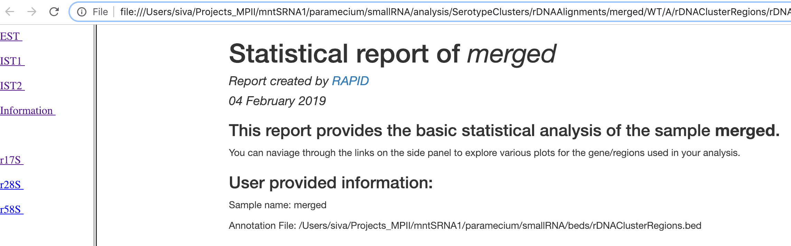

The left panel contains the list of regions/genes provided as part of the BED file to create the plots. Each region contains the following plots, if applicable. 

Read alignment percentage of various read lengths
^^^^^^^^^^^^^^^^^^^^^^^^^^^^^^^^^^^^^^^^^^^^^^^^^
This plot shows various read lengths (x-axis) utilized in the analysis and their percentage of alignment (y-axis). Read length distribution plot is important to see if there is a predominance of certain length transcripts. As sRNA mechanisms are rather sensitive and specific, different length predominance can indicate different downstream pathways of the sRNA.

Alignment percentage of reads with (Not)Soft-clipped bases
^^^^^^^^^^^^^^^^^^^^^^^^^^^^^^^^^^^^^^^^^^^^^^^^^^^^^
This plot shows the alignment percentage of reads (y-axis) containing soft-clipped bases (x-axis; Soft-clipping status). Soft-clipping refers to the bases (five-prime or three-prime) in a read that are not part of the alignment. This helps in understanding the percentage of aligned sRNA which has non-specific alignments. In sRNA mechanisms, as it is not uncommon to exclude bases in five or three prime end to achieve base-pairing, this plot can give insights into the mode of base-pairing of the sRNAs in downstream mechanisms.  

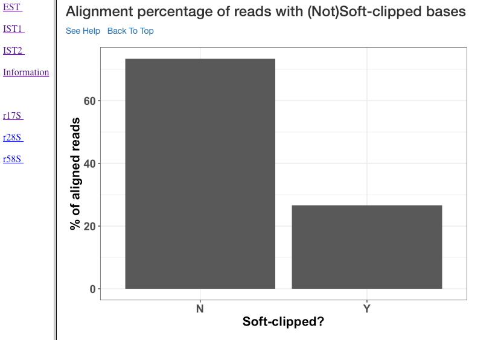

Strand specific alignment percentage of reads
^^^^^^^^^^^^^^^^^^^^^^^^^^^^^^^^^^^^^^^^^^^^^^
The alignment percentage (y-axis) of reads corresponding to each strand (x-axis) is shown in this plot. sRNA mechanisms are quite specific to length, and their strand of origin. This plot helps in understanding which strand shows a predominance in the library, such that one can hypothesise the role of the analysed small RNAs. For instance, an antisense predominance could indicate a cis-acting mechanism in modulating the target mRNA.

Reads aligned with soft clipping above 'n' reads
^^^^^^^^^^^^^^^^^^^^^^^^^^^^^^^^^^^^^^^^^^^^^^^^^^^^^
This plot shows the soft-clipped bases (x-axis) and the number of reads (y-axis) containing such soft-clipping. We only show bases which have at least 'n' reads; where, 'n' corresponds to 5% of the overall alignment. This plot can help in understanding, if any particular nucleotide is always soft-clipped. It could simply indicate a potential technical inadequacy in trimming adapter, or primer, etc. Also, depending on the organism, biological mechanisms, such as poly-A tailing of small RNAs, may exist. This plot thus gives a chance for the user to see if there is a RNA modification pathway existing, or whether change in conditions are affecting RNA modification frequencies.

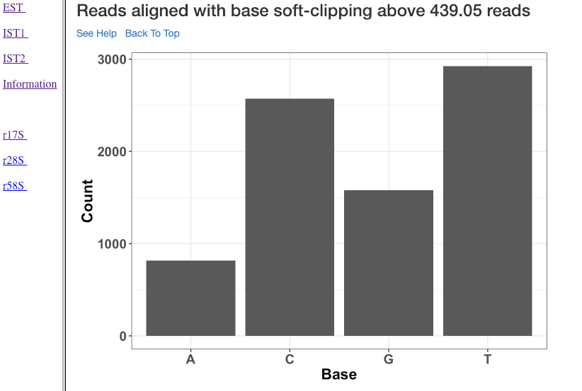

Alignment percentage of reads with soft clipping above 'n' reads
^^^^^^^^^^^^^^^^^^^^^^^^^^^^^^^^^^^^^^^^^^^^^^^^^^^^^^^^^^^^^^^^^^^^^
This plot (similar to the previous plot) shows the soft-clipped bases (x-axis) and the percentage of reads (y-axis) containing such soft-clipping. We only show bases which have at least 'n' reads; where, 'n' corresponds to 5% of the overall alignment.

Strand specific reads of varied length
^^^^^^^^^^^^^^^^^^^^^^^^^^^^^^^^^^^^^^
This plot shows various read lengths (x-axis) utilized in the analysis and their read counts (y-axis), specific to each strand. Length, and strand of origin plays an important role in understanding sRNA mechanisms. For instance, an antisense predominance of 23nt bases could indicate a cis-acting mechanism in modulating the target mRNA, and dicer activity. 

Soft-clipping status specific reads of varied length
^^^^^^^^^^^^^^^^^^^^^^^^^^^^^^^^^^^^^^^^^^^^^^^^^^^
Various read lengths (x-axis) utilized in the analysis and their read counts (y-axis), specific to their soft-clipping status is shown in this plot. This plot can further assist in understanding which read lengths are affected by soft-clipping, and if it is important to handle the soft-clipped bases before proceeding to downstream analysis.

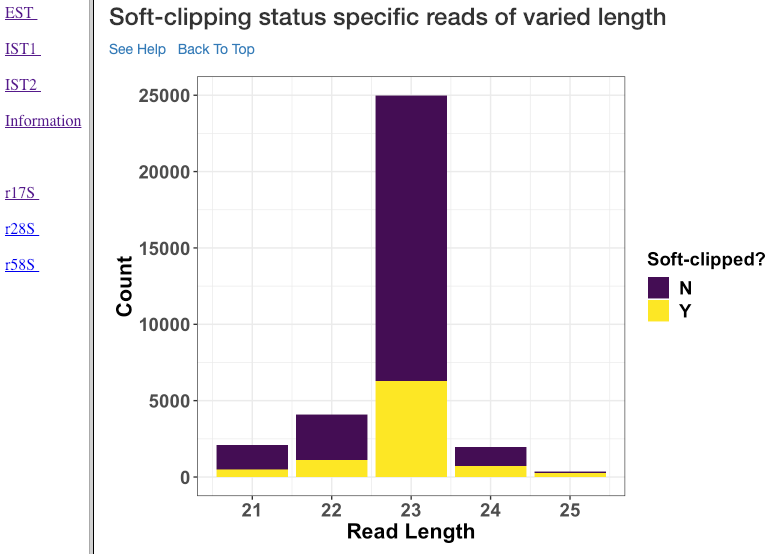

1-base soft-clipping specific reads of varied length
^^^^^^^^^^^^^^^^^^^^^^^^^^^^^^^^^^^^^^^^^^^^^^^^^^^
This plot shows various read lengths (x-axis) utilized in the analysis and their read counts (y-axis), with respected to the soft-clipped bases. Only the single bases (A,T,G and C) soft-clipped were considered. This plot can help in understanding, if any particular nucleotide is always soft-clipped. It could further indicate the potential source of the soft-clipped bases. For instance, untrimmed adapter, or primer, etc. 

Strand specific reads with respect to base soft-clipping status
^^^^^^^^^^^^^^^^^^^^^^^^^^^^^^^^^^^^^^^^^^^^^^^^^^^^^^^^^^^^^^
This plot shows the strand (x-axis) specific read counts (y-axis) with their base soft-clipping status. This plot can further assist in understanding which strands are affected by soft-clipping, and if it is important to handle the soft-clipped bases before proceeding to downstream analysis.

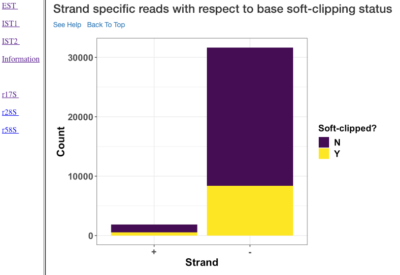

Strand specific coverage plot
^^^^^^^^^^^^^^^^^^^^^^^^^^^^^
This plot shows the strand specific coverage (1bp resolution). A coverage plot helps in understanding if a particular sub-region in an analysed gene/region has a major predominance. It could also show, if a region appears to be phased giving insights in to the mechanism of action.

Visualization: Comparison Report
--------------------------------
This section describe the plots in the comparison report produced from *rapidVis*. The normalized values mentioned below corresponds to the normalization method you choose, while running *rapidNorm*.

The plots are split in to three categories. 

* Quality Plots
* Sample based comparison
* Gene based comparison

Clustered heatmap of TPM
^^^^^^^^^^^^^^^^^^^^^^^^
This is a heatmap of the TPM of gene/region corresponding to the samples analyzed. The dendograms shown are calculated using the default clustering parameters of heatmap.2 function, which uses a complete linkage method with an euclidean measure.

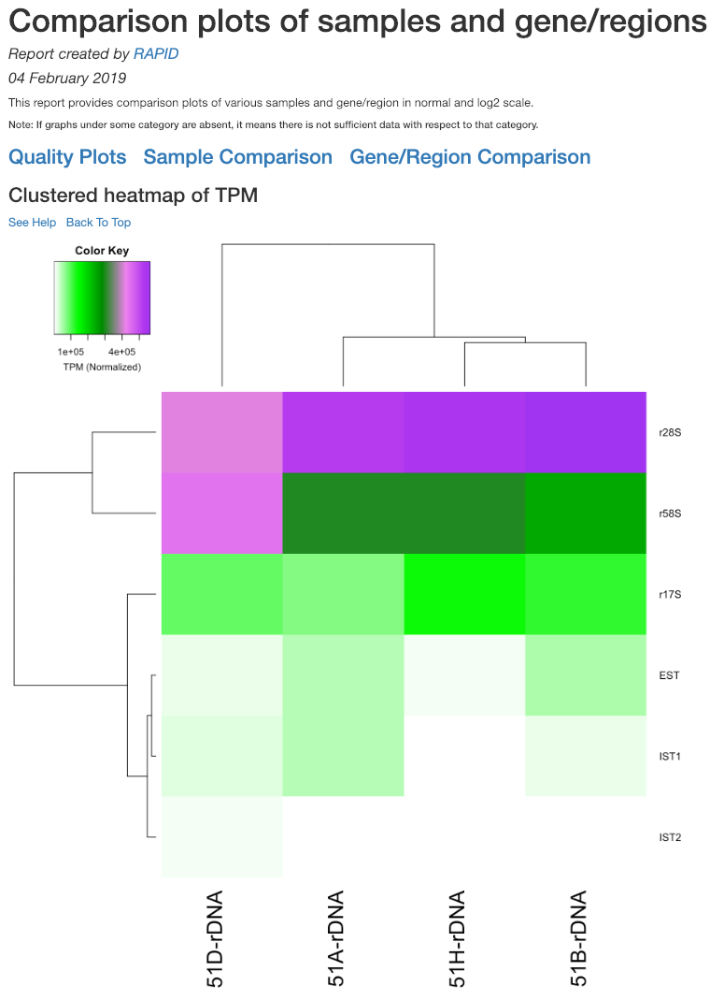

Clustered heatmap of antisense ratio
^^^^^^^^^^^^^^^^^^^^^^^^^^^^^^^^^^^^
This is a heatmap of the antisense ratio of gene/region corresponding to the samples analyzed. The dendograms shown are calculated using the default clustering parameters of heatmap.2 function, which uses a complete linkage method with an euclidean measure.

Clustered heatmap of average read count (log2 scale)
^^^^^^^^^^^^^^^^^^^^^^^^^^^^^^^^^^^^^^^^^^^^^^^^^^^^
This is a heatmap of the average read count (log2) of gene/region corresponding to the samples analyzed. The dendograms shown are calculated using the default clustering parameters of heatmap.2 function, which uses a complete linkage method with an euclidean measure. Average read count is calculated as the reads aligned to a gene divided by the gene length. 

PCA plot of samples
^^^^^^^^^^^^^^^^^^^
This principle component analysis (PCA) plot shows where your samples fall in the first and second principle components. The principle componenets are calculated using the read counts of each sample. When replicates of a sample are grouped together in this plot, it is an indication of good quality replicates.

.. image:: ./images/rDNA_Comp_plot4.png

MDS plot of samples
^^^^^^^^^^^^^^^^^^^
This multi dimensional scaling (MDS) plot shows the proximities of your samples in two dimension. Read counts of each sample is used for performing MDS. When replicates of a sample are grouped together in this plot, it is an indication of good quality replicates.

Box plot of read counts
^^^^^^^^^^^^^^^^^^^^^^^^
This is a box plot of the normalized read counts of each gene/region across all the samples used in the analysis. This can indicate the variance among samples for a specific gene/region.

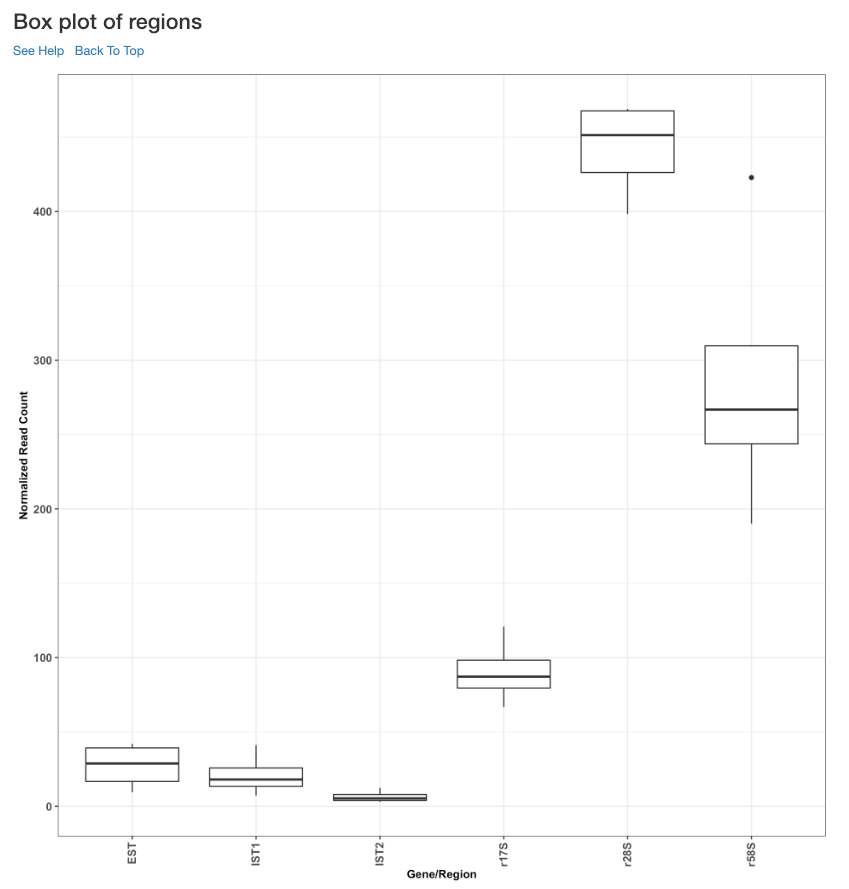

Sample wise comparison of normalised read counts for each gene/region
^^^^^^^^^^^^^^^^^^^^^^^^^^^^^^^^^^^^^^^^^^^^^^^^^^^^^^^^^^
This plot shows the normalised read counts of each sample for each gene/region.

Sample wise comparison of normalised read counts for each gene/region (log2 scale)
^^^^^^^^^^^^^^^^^^^^^^^^^^^^^^^^^^^^^^^^^^^^^^^^^^^^^^^^^^^^^^^^^^^^^^^
Log2 of normalised read counts of each sample for each gene/region is shown in this plot.

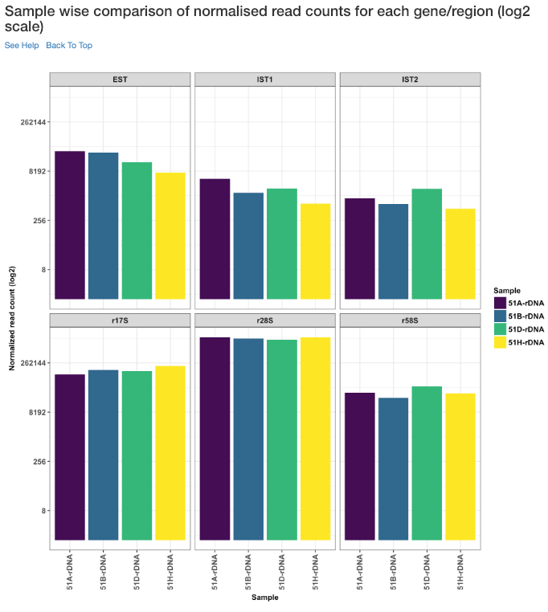

Sample wise comparison of TPM for each gene/region
^^^^^^^^^^^^^^^^^^^^^^^^^^^^^^^^^^^^^^^^^^^^^^^^^^
This plot shows the TPM values of each sample for each gene/region. TPM values are calculated from the read counts, after accounting for read length restrictions, if provided by user. 

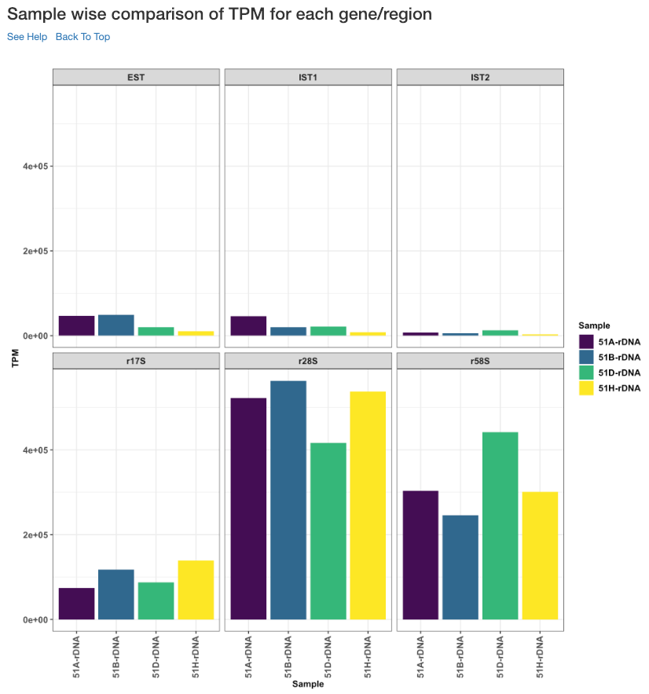

Sample wise comparison of TPM for each gene/region (log2 scale)
^^^^^^^^^^^^^^^^^^^^^^^^^^^^^^^^^^^^^^^^^^^^^^^^^^^^^^^^^^^^^^^
Log2 of TPM Values of each sample for each gene/region is shown in this plot. TPM values are calculated from the read counts, after accounting for read length restrictions, if provided by user.

Sample wise comparison of antisense ratio for each gene/region
^^^^^^^^^^^^^^^^^^^^^^^^^^^^^^^^^^^^^^^^^^^^^^^^^^^^^^^^^^^^^^
This plot shows the antisense ratio of each sample is shown for each gene/region.

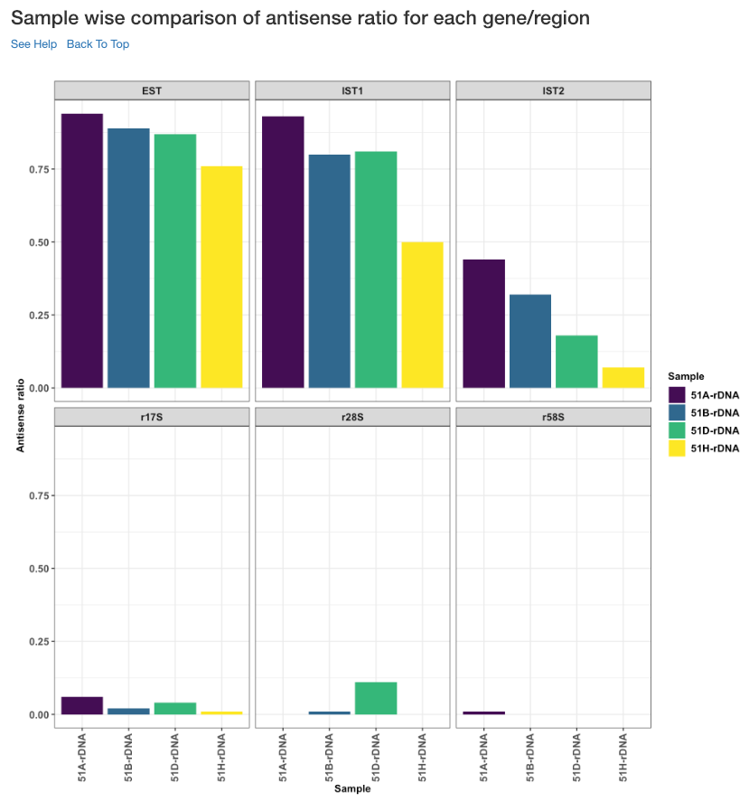

Gene/Region wise comparison of normalised read counts for each sample
^^^^^^^^^^^^^^^^^^^^^^^^^^^^^^^^^^^^^^^^^^^^^^^^^^^^^^^^^^^^^^^^^^
This plot shows the gene/region wise normalised read counts for each sample.

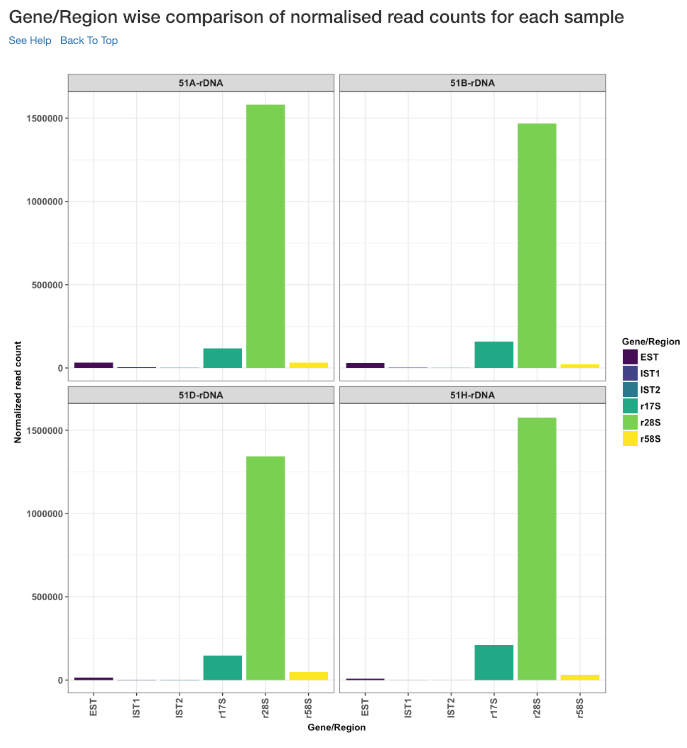

Gene/Region wise comparison of normalised read counts for each sample (log2 scale)
^^^^^^^^^^^^^^^^^^^^^^^^^^^^^^^^^^^^^^^^^^^^^^^^^^^^^^^^^^^^^^^^^^^^^^^^^^^^^^^
Log2 of gene/region wise normalised read counts for each sample is shown in this plot.

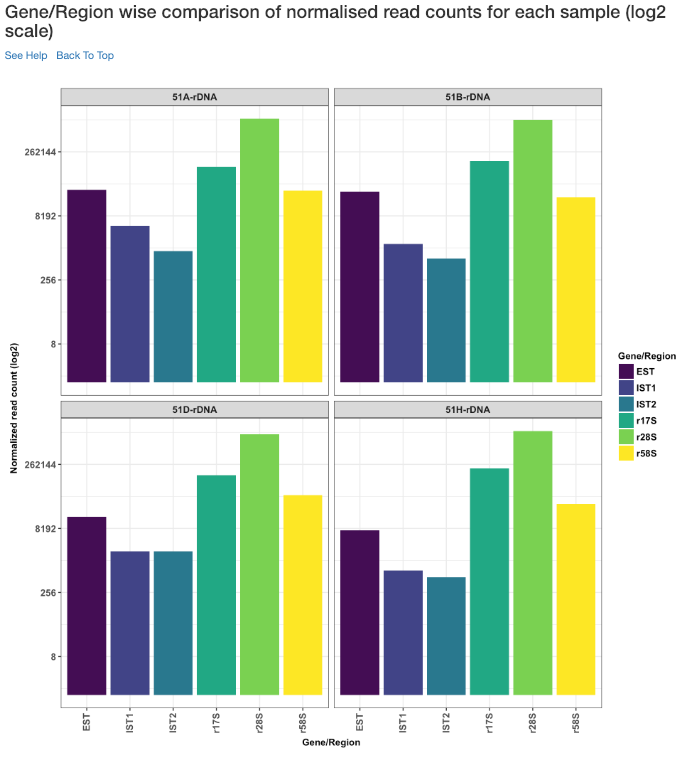

Gene/Region wise comparison of TPM for each sample
^^^^^^^^^^^^^^^^^^^^^^^^^^^^^^^^^^^^^^^^^^^^^^^^^^
This plot shows the gene/region wise TPM for each sample. TPM values are calculated from the read counts, after accounting for read length restrictions, if provided by user.

Gene/Region wise comparison of TPM for each sample (log2 scale)
^^^^^^^^^^^^^^^^^^^^^^^^^^^^^^^^^^^^^^^^^^^^^^^^^^^^^^^^^^^^^^^
Log2 of gene/region wise TPM for each sample is shown in this plot. TPM values are calculated from the read counts, after accounting for read length restrictions, if provided by user.

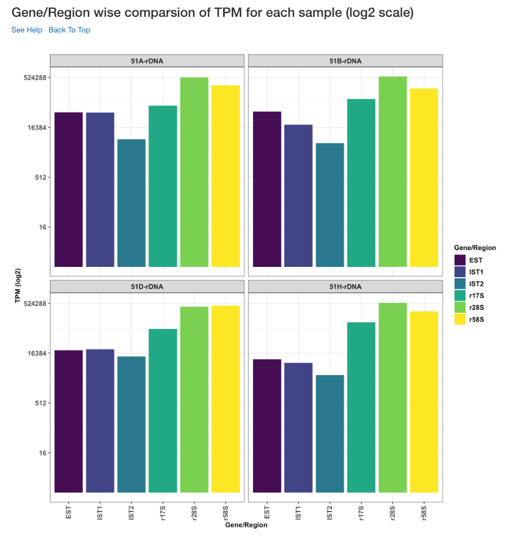

Gene/Region wise comparison of antisense ratio for each sample
^^^^^^^^^^^^^^^^^^^^^^^^^^^^^^^^^^^^^^^^^^^^^^^^^^^^^^^^^^^^^^
Antisense ratio of gene/region for each samples is shown in this plot.

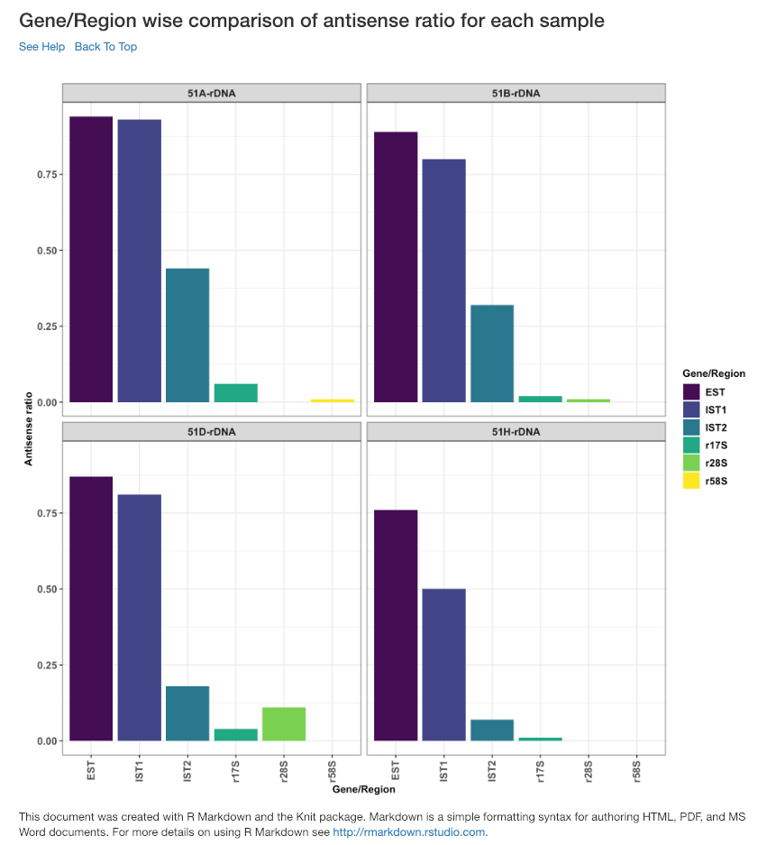
